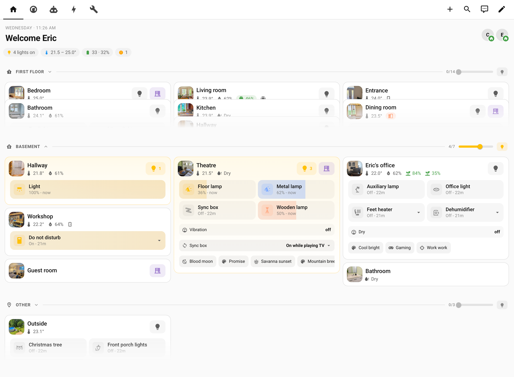

# Atrium Dashboard

[![HACS Custom][hacs-shield]][hacs-url]
[![Tests][tests-shield]][tests-url]
[![License: Apache 2.0][license-shield]][license-url]

Atrium is a fully dynamic Lovelace dashboard for Home Assistant, distributed as a **custom [Lovelace strategy](https://www.home-assistant.io/dashboards/strategies/)**. Floors, rooms, and entities are read from Home Assistant at load time — adding an area or a light in HA is enough to update the UI. No YAML editing, no per-room configuration.

- **Home** — every floor and area, auto-grouped by domain (lights, switches, covers, sensors, …), with a per-floor dimmer.
- **Climate** — every thermostat, with an optional live temperature graph.
- **Routines** — scenes, automations, and scripts, with an optional validation-checklist widget.
- Any number of **custom tabs** — fully config-driven, for things the strategy can't auto-discover (energy monitoring, system health, etc.).

The whole thing is plain ES modules — no build step, no bundler, no framework, no runtime dependencies.

<p align="center">
  <picture>
    <source media="(prefers-color-scheme: dark)" srcset="images/preview-dark.png">
    
  </picture>
</p>

## Prerequisites

1. [HACS](https://hacs.xyz/) installed on your Home Assistant instance.
2. Through HACS → Frontend, install [mini-graph-card](https://github.com/kalkih/mini-graph-card) — used to render the background temperature graph on each climate tile. Optional: without it, the tile still works, just without the graph.
3. Optional: [card-mod](https://github.com/thomasloven/lovelace-card-mod) — used for padding on custom tabs. If not installed, that key is simply ignored.
4. A reasonably recent Home Assistant version with the Areas/Floors registry (2024.10 or newer).

## Installation

### Via HACS (recommended)

This repository isn't in the default HACS store yet, so add it as a custom repository first:

1. In Home Assistant, go to **HACS**.
2. Click the **⋮** menu (top-right) → **Custom repositories**.
3. Add `https://github.com/ericmatte/ha-atrium-dashboard`, category **Plugin** (called "Dashboard" or "Lovelace" in some HACS versions).
4. Find **Atrium Dashboard** in HACS → Frontend, and install it.
5. HACS downloads the files to `/config/www/community/ha-atrium-dashboard/`.
6. Go to **Settings → Dashboards → Resources** (⋮ menu → Resources, if not shown). HACS usually registers the resource automatically; if `Atrium Dashboard` isn't listed there, add it manually:
   - URL: `/hacsfiles/ha-atrium-dashboard/strategy.js`
   - Resource type: **JavaScript module**
7. Continue with [Setting up the dashboard](#setting-up-the-dashboard) below.

### Manual installation

1. Copy this repository's files into your Home Assistant `/config/www/atrium/` directory (File editor add-on, Samba, or `scp`).
2. Go to **Settings → Dashboards → Resources**, add:
   - URL: `/local/atrium/strategy.js`
   - Resource type: **JavaScript module**
3. Continue with [Setting up the dashboard](#setting-up-the-dashboard) below.

## Setting up the dashboard

1. Reload the browser (hard refresh) so HA picks up the new resource.
2. Go to **Settings → Dashboards → Add Dashboard → New dashboard from scratch**.
   - Title: `Atrium` (or anything you like)
   - Icon: `mdi:home-variant`
   - Show in sidebar: on
3. Open the new dashboard, then **⋮ (top-right) → Edit dashboard → ⋮ → Raw configuration editor**, replace the content with:

   ```yaml
   strategy:
     type: custom:atrium
   views: []
   ```

4. Save. The dashboard rebuilds itself on every load from your HA floors/areas/entities.

## Custom tabs

`Home`, `Climate`, and `Routines` are auto-discovered from your HA floors/areas. Anything beyond that (energy monitoring, system health, etc.) is manual and config-driven via a `tabs` list on the strategy — there are zero of these until you add some, and each one you add is appended as its own tab, in order, after `Routines`:

```yaml
strategy:
  type: custom:atrium
  tabs:
    - title: Energy
      icon: mdi:lightning-bolt
      cards:
        - type: vertical-stack
          cards: [...]
    - title: Maintenance
      icon: mdi:wrench
      cards:
        - type: entities
          title: System Info
          entities: [...]
```

Per tab:

- `title` (required) — shown on the tab and as the view's header title.
- `icon` (optional) — tab icon, defaults to `mdi:view-dashboard`.
- `path` (optional) — URL path segment, defaults to `title` slugified (e.g. `Energy` → `energy`).
- `cards` (optional) — any Lovelace cards, rendered as-is below the header.
- `entities` (optional) — a plain list of entity IDs, rendered as a single `entities` card above `cards`.
- `entities_title` (optional) — title for that `entities` card; defaults to the tab's `title`.

There's no limit on how many tabs you add.

## Validation checklists (optional)

The Routines tab can show a two-level checklist widget (`change` / `ongoing` items) per automation, backed by two native **Local To-do** lists so items are checkable from any HA client. It's entirely optional — with an empty manifest (the default, shipped as `validation-checklists.json`), the widget renders nothing.

To use it:

1. Go to **Settings → Devices & services → Add integration → Local To-do**, and create two lists. By default the widget expects them to resolve to `todo.validation_changement` and `todo.validation_suivi_long_terme` — check the actual entity IDs Home Assistant assigns, and adjust the `LEVELS` constant in [`components/validation-card.js`](components/validation-card.js) if they differ (this also lets you rename/relabel the two levels).
2. Populate `validation-checklists.json` with your own content, keyed by an automation slug of your choice:

   ```json
   {
     "my_automation": {
       "label": "🌡️ My Automation",
       "entity": "automation.my_automation",
       "change": [
         { "id": "some-stable-id", "text": "Describe what to verify" }
       ],
       "ongoing": [
         { "id": "another-stable-id", "text": "Describe a recurring scenario to re-check" }
       ]
     }
   }
   ```

   - `label` — shown as the section title.
   - `entity` (optional) — when set, the title links to that entity's more-info dialog.
   - `change` — one-off items to validate after a specific change; remove the entry once confirmed.
   - `ongoing` — recurring scenarios to keep re-validating over time; leave these in place indefinitely.
   - Each item's `id` must stay stable across edits — it's used to correlate the manifest entry with its to-do item.

## Development

No build step or dependencies — plain ES modules, tested with Node's built-in test runner:

```sh
node --test
```

## License

[Apache License 2.0](LICENSE).

[hacs-shield]: https://img.shields.io/badge/HACS-Custom-41BDF5.svg
[hacs-url]: https://hacs.xyz/docs/faq/custom_repositories
[tests-shield]: https://github.com/ericmatte/ha-atrium-dashboard/actions/workflows/test.yml/badge.svg
[tests-url]: https://github.com/ericmatte/ha-atrium-dashboard/actions/workflows/test.yml
[license-shield]: https://img.shields.io/badge/license-Apache%202.0-blue.svg
[license-url]: LICENSE
