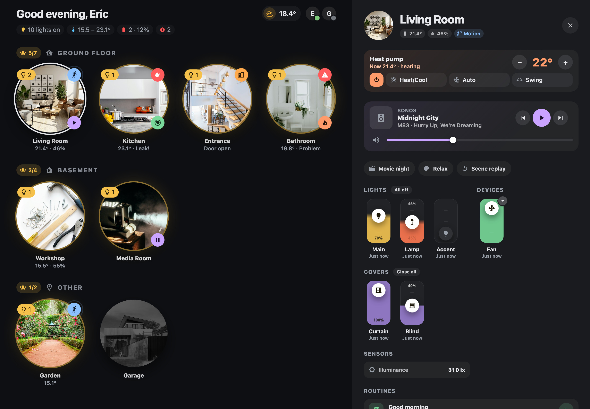

# Atrium Dashboard

[![HACS Custom][hacs-shield]][hacs-url]
[![Tests][tests-shield]][tests-url]
[![License: Apache 2.0][license-shield]][license-url]

Atrium is a fully dynamic Lovelace dashboard for Home Assistant.
No YAML editing, no per-room configuration.

- **Home** — every floor and area as a photo tile. Tap one to open its details panel: lights, switches and covers as swipe-to-dim tiles, the room's thermostat, scenes, sensor readings, and its routines (scripts & automations) — all in one place, no separate Routines tab.
- Any number of **custom tabs** — fully config-driven, for things the strategy can't auto-discover (energy monitoring, system health, etc.).



## Prerequisites

1. [HACS](https://hacs.xyz/) installed on your Home Assistant instance.

## Installation

### Via HACS (recommended)

This repository isn't in the default HACS store yet, so add it as a custom repository first:

1. In Home Assistant, go to **HACS**.
2. Click the **⋮** menu (top-right) → **Custom repositories**.
3. Add `https://github.com/ericmatte/ha-atrium-dashboard`, category **Dashboard**.
4. Find **Atrium Dashboard** in HACS → Frontend, and install it.
5. HACS downloads `strategy.js` (a self-contained bundle) to `/config/www/community/ha-atrium-dashboard/`.
6. Go to **Settings → Dashboards → Resources** (⋮ menu → Resources, if not shown). HACS usually registers the resource automatically; if `Atrium Dashboard` isn't listed there, add it manually:
   - URL: `/hacsfiles/ha-atrium-dashboard/strategy.js`
   - Resource type: **JavaScript module**
7. Continue with [Setting up the dashboard](#setting-up-the-dashboard) below.

### Manual installation

1. Build the project (`npm install && npm run build`) or download `dist/strategy.js` from a [release](https://github.com/ericmatte/ha-atrium-dashboard/releases), then copy just that one file into your Home Assistant `/config/www/atrium/` directory (File editor add-on, Samba, or `scp`).
2. Go to **Settings → Dashboards → Resources**, add:
   - URL: `/local/atrium/strategy.js`
   - Resource type: **JavaScript module**
3. Continue with [Setting up the dashboard](#setting-up-the-dashboard) below.

## Setting up the dashboard

1. Reload the browser (hard refresh) so HA picks up the new resource.
2. Go to **Settings → Dashboards → Add Dashboard → New dashboard from scratch**.
   - Title: `Atrium` (or anything you like)
   - Icon: `mdi:home-variant`
   - Show in sidebar: on
3. Open the new dashboard, then **⋮ (top-right) → Edit dashboard → ⋮ → Raw configuration editor**, replace the content with:

   ```yaml
   strategy:
     type: custom:atrium
   views: []
   ```

4. Save. The dashboard rebuilds itself on every load from your HA floors/areas/entities.

## Custom tabs

`Home` is auto-discovered from your HA floors/areas. Anything beyond that (energy monitoring, system health, etc.) is manual and config-driven via a `tabs` list on the strategy — there are zero of these until you add some, and each one you add is appended as its own tab, in order, after `Home`:

```yaml
strategy:
  type: custom:atrium
  tabs:
    - title: Energy
      icon: mdi:lightning-bolt
      cards:
        - type: vertical-stack
          cards: [...]
    - title: Maintenance
      icon: mdi:wrench
      cards:
        - type: entities
          title: System Info
          entities: [...]
```

Per tab:

- `title` (required) — shown on the tab and as the view's header title.
- `icon` (optional) — tab icon, defaults to `mdi:view-dashboard`.
- `path` (optional) — URL path segment, defaults to `title` slugified (e.g. `Energy` → `energy`).
- `cards` (optional) — any Lovelace cards, rendered as-is below the header.
- `entities` (optional) — a plain list of entity IDs, rendered as a single `entities` card above `cards`.
- `entities_title` (optional) — title for that `entities` card; defaults to the tab's `title`.

There's no limit on how many tabs you add.

## Development

```sh
npm install
npm test          # runs the unit tests under src/
npm run build     # bundles src/strategy.js into dist/strategy.js
```

`dist/strategy.js` is rebuilt and committed automatically on every push to `main` — you don't need to build or commit it yourself when opening a PR.

## License

[Apache License 2.0](LICENSE).

[hacs-shield]: https://img.shields.io/badge/HACS-Custom-41BDF5.svg
[hacs-url]: https://hacs.xyz/docs/faq/custom_repositories
[tests-shield]: https://github.com/ericmatte/ha-atrium-dashboard/actions/workflows/test.yml/badge.svg
[tests-url]: https://github.com/ericmatte/ha-atrium-dashboard/actions/workflows/test.yml
[license-shield]: https://img.shields.io/badge/license-Apache%202.0-blue.svg
[license-url]: LICENSE
